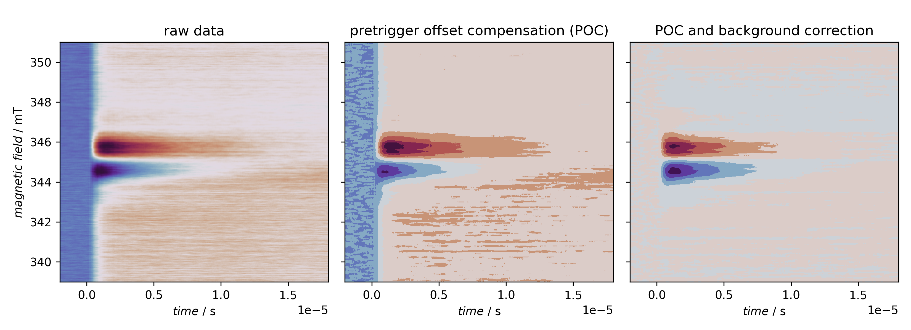
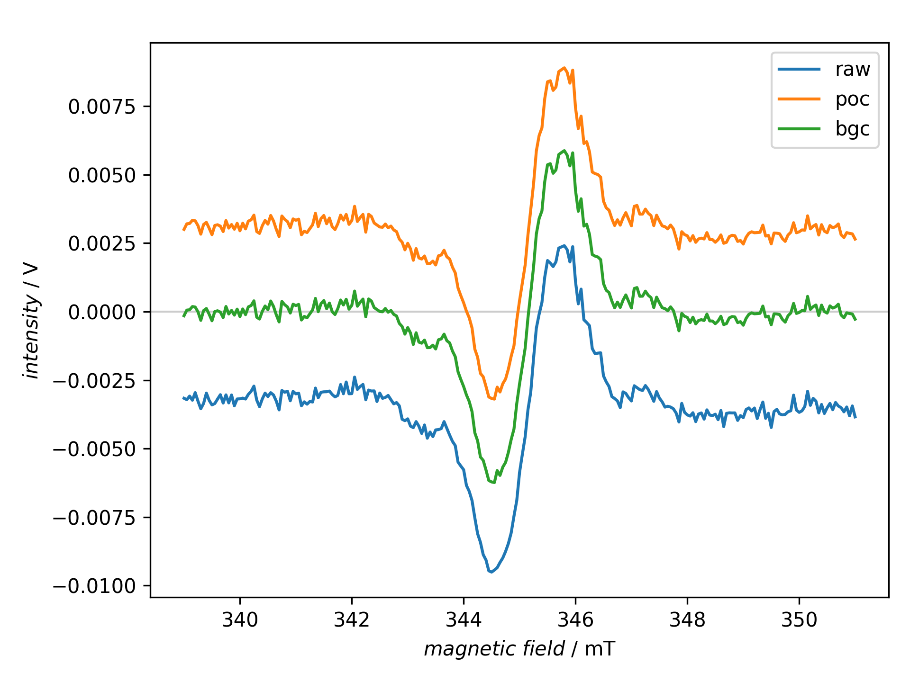

========================================
Additional (laser) background correction
========================================

tr-EPR spectra are typically recorded as full time profiles for a series of magnetic field positions, and to obtain the full kinetics, it is crucial to record the time traces starting before the laser flash.

The part before the laser flash that triggers the actual measurement is usually termed "pretrigger offset". The first preprocessing step of raw data is hence to take this pretrigger offset and set its average to zero, *i.e.* average over this part of the time trace and subtract this average value from the entire time trace. This removes any DC offset of the recording.

Additionally, the laser hitting the EPR cavity usually leads to a slight detuning that manifests itself in an (absorptive) background signal. Depending on the recording scheme used, this background is either subtracted already in the transient recorder or needs to be removed afterwards to be able to properly analyse the data.

A necessary prerequisite for performing such background correction afterwards is to record your data with sufficient range of the magnetic field on both sides of the actual signal that can be considered off-resonant, *i.e.* background, and hence used for background correction.

You can control the number of time traces used for the background correction on both ends of the magnetic field range. The crucial part of the recipe is shown below:

.. literalinclude:: ../../examples/basic-processing/basic-processing.yaml
    :language: yaml
    :linenos:
    :lines: 69-73
    :lineno-start: 69

Here, ten time profiles at both ends of the magnetic field range are used for calculating and subtracting the background. If you use time profiles at both ends of the magnetic field range, those profiles are averaged over and a linear interpolation performed between both ends. This allows to compensate for linear drifts in the background intensity.

The remainder of the recipe besides loading the data serves rather didactic purposes, such as plotting the raw and processed data and comparing extracted spectra before and after processing.

Recipe
======

.. literalinclude:: ../../examples/basic-processing/basic-processing.yaml
    :language: yaml
    :linenos:
    :caption: Pretrigger offset compensation is always the first preprocessing step for tr-EPR data. If not already subtracted within the transient recorder, the laser-induced background needs to be subtracted as well, taking time profiles at the beginning (and end) of the magnetic field range, average over, and subtract them from the entire dataset. The actual processing steps are rather short, the rest of the recipe serves didactic purposes, mainly a graphical before--after cpmparison.

Result
======

The recipe actually creates two figures presented afterwards.

    Overview of standard processing steps of tr-EPR data. The first step is always to correct for DC offsets of the transients prior to the laser flash (POC), followed by subtracting the laser-induced background (BGC). The latter is sometimes carried out during data acquisition by regularly recording off-resonant transients and subtracting their signal within the transient recorder.

    Standard processing steps of tr-EPR data from the view-point of spectra taken near the signal maximum.
    In this case, the pretrigger offset compensation (POC) does not have such a clear impact on the spectral shape, but clearly on position on the y axis. The background correction works similar to a polynomial baseline correction and operates on the complete two-dimensional dataset.
