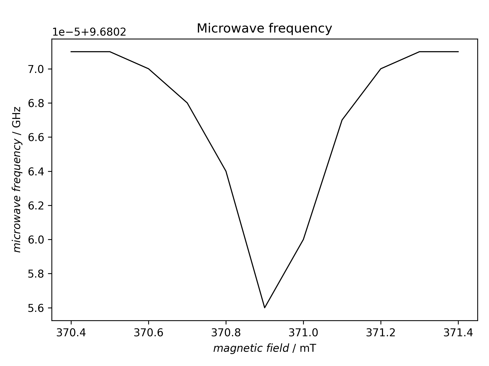
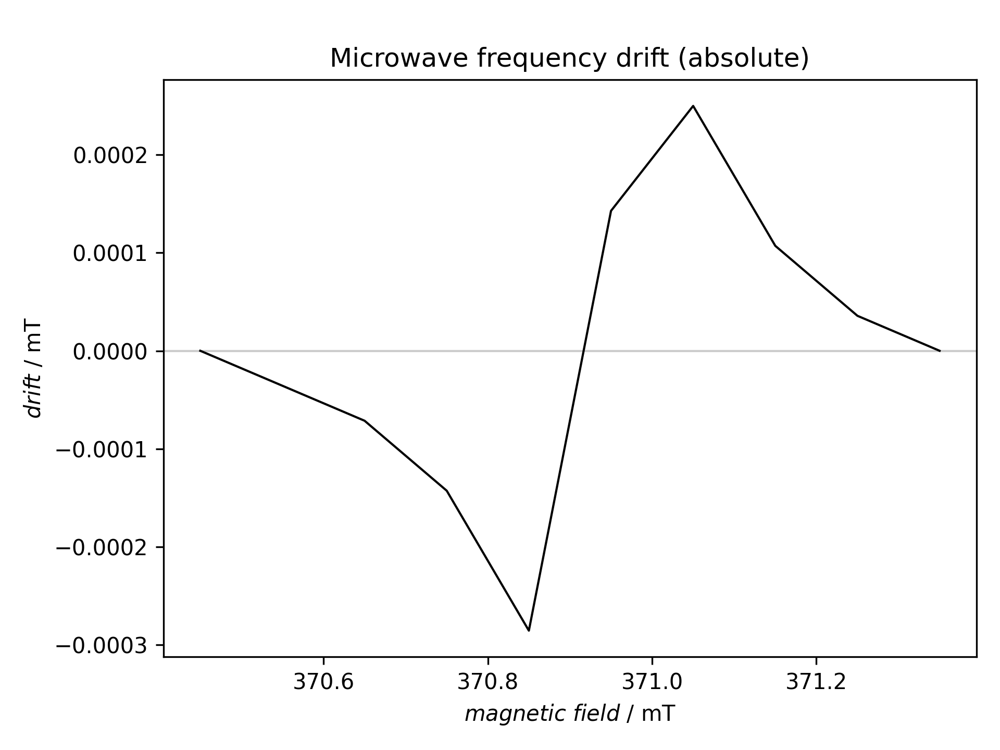
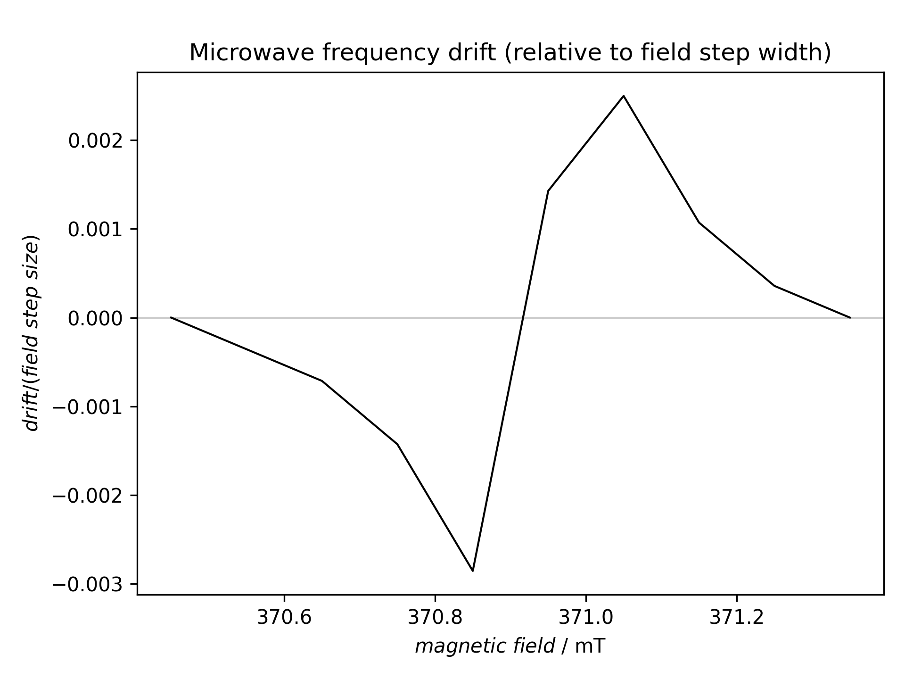

================================
Drift of the microwave frequency
================================

Classes used:

* :class:`trepr.analysis.MWFrequencyValues`

General description
===================

tr-EPR experiments usually take quite some time (hours rather than minutes) due to their 2D character, and thus the microwave frequency of the source will drift in some way. This is no problem as long as the drift is small compared to the magnetic field step width.

A necessary prerequisite to figure out how and how much the microwave frequency has changed during the measurement is to record the microwave frequency during the measurement, at least one value per time trace, with necessary accuracy. Using a commercial Bruker setup and software, this is usually not (easily) possible. However, if you use some lab-built software to control your tr-EPR setup, it is entirely up to this software.

The following example demonstrates what is possible when the relevant information is available for each individual time trace. Basically, the recipe creates three plots: microwave frequency as function of the magnetic field, microwave frequency drift in absolute values, and the relative drift with respect to the step width of the magnetic field. Only if the relative drift is comparable (or even larger) than the field step will the measurement be affected.

Recipe
======

.. literalinclude:: ../../examples/mwfreq-analysis/mwfreq-analysis.yaml
    :language: yaml
    :linenos:
    :caption: Analysing the drift of the microwave frequency over the course of the tr-EPR experiment. Only if the relative drift is comparable (or even larger) than the magnetic field step will the measurement be affected.

Result
======

The recipe actually creates three figures presented afterwards.

    Microwave frequency as function of the magnetic field.
    The perhaps unexpected shape results from the fact that the data have not been recorded from low to high field (or *vice versa*), but inside out or outside in.

    Absolute drift of the microwave frequency expressed in magnetic field units (mT) as function of the magnetic field. The perhaps unexpected shape results from the fact that the data have not been recorded from low to high field (or *vice versa*), but inside out or outside in.

    Relative drift of the microwave frequency expressed as magnetic field step ratio as function of the magnetic field. Only if these values are in the dimension of 1 (or even larger) will the measurement be affected. The perhaps unexpected shape results from the fact that the data have not been recorded from low to high field (or *vice versa*), but inside out or outside in.
