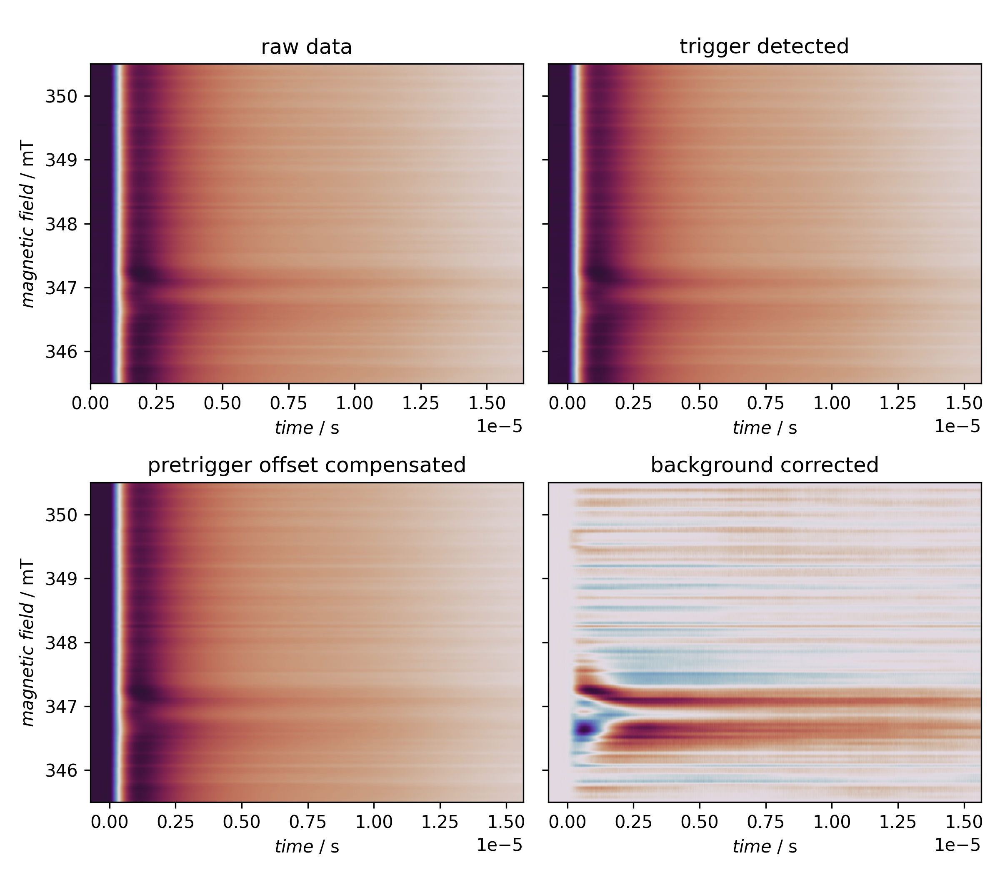

============================================================
Determining the pretrigger part of the signal (Bruker BES3T)
============================================================

tr-EPR spectra are typically recorded as full time profiles for a series of magnetic field positions, and to obtain the full kinetics, it is crucial to record the time traces starting before the laser flash.

The part before the laser flash that triggers the actual measurement is usually termed "pretrigger offset". The first preprocessing step of raw data is hence to take this pretrigger offset and set its average to zero, *i.e.* average over this part of the time trace and subtract this average value from the entire time trace. This removes any DC offset of the recording.

A prerequisite of this preprocessing step is to have a time trace with a time axis starting at negative times, the trigger being defined by *t* = 0. If your recorded data start with *t* = 0 and a laser trigger at a later time *t* > 0, you need to determine the pretrigger part of your time trace first. This is shown here.

The crucial step is to first determine the trigger and only afterwards proceed with the pretrigger offset compensating and other processing steps:

.. literalinclude:: ../../examples/basic-processing-bes3t/basic-processing-bes3t.yaml
    :language: yaml
    :linenos:
    :lines: 30-31
    :lineno-start: 30

.. literalinclude:: ../../examples/basic-processing-bes3t/basic-processing-bes3t.yaml
    :language: yaml
    :linenos:
    :lines: 48-49
    :lineno-start: 48

The other part of the recipe besides loading the data serves rather didactic purposes, such as plotting the raw and processed data and comparing extracted traces before and after processing.

Recipe
======

.. literalinclude:: ../../examples/basic-processing-bes3t/basic-processing-bes3t.yaml
    :language: yaml
    :linenos:
    :caption: Pretrigger offset compensation is always the first preprocessing step for tr-EPR data. However, if time traces were not recorded with the pretrigger part as negative times, you need to determine the trigger position first. The actual processing step is a two-liner, the rest of the recipe serves didactic purposes, mainly a graphical before--after cpmparison.

Result
======

The recipe actually creates one figure with four panels presented below.

    Overview of standard processing steps of tr-EPR data if no pretrigger part is explicitly recorded. The first step here is to determine the trigger position. Only afterwards can the DC offsets of the transients prior to the laser flash be compensated, followed by subtracting the laser-induced background.
