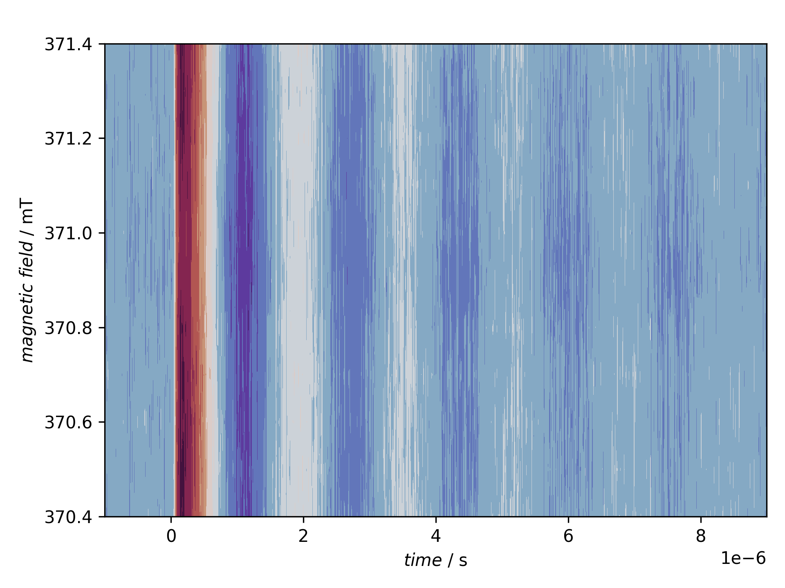
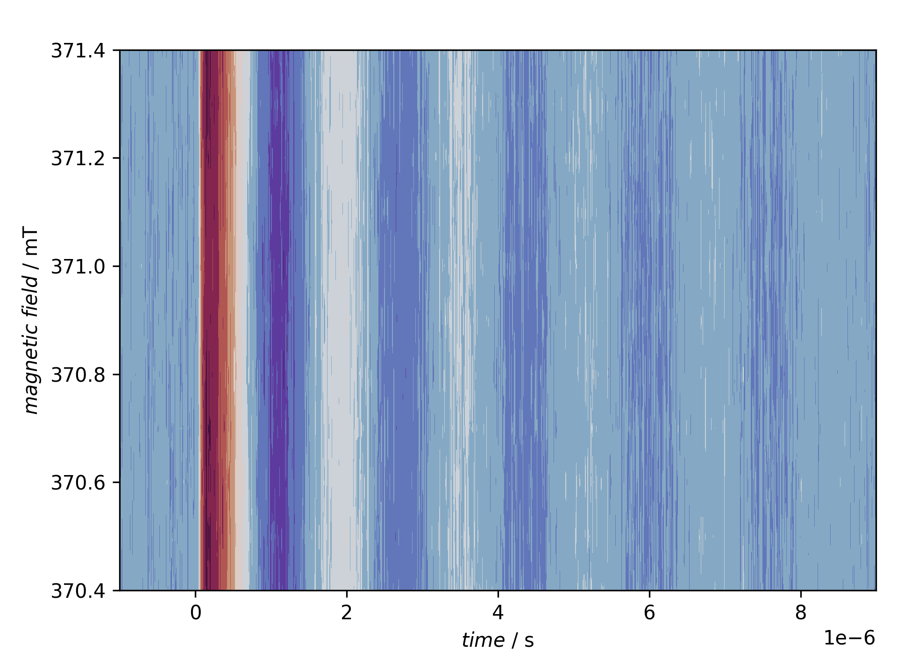
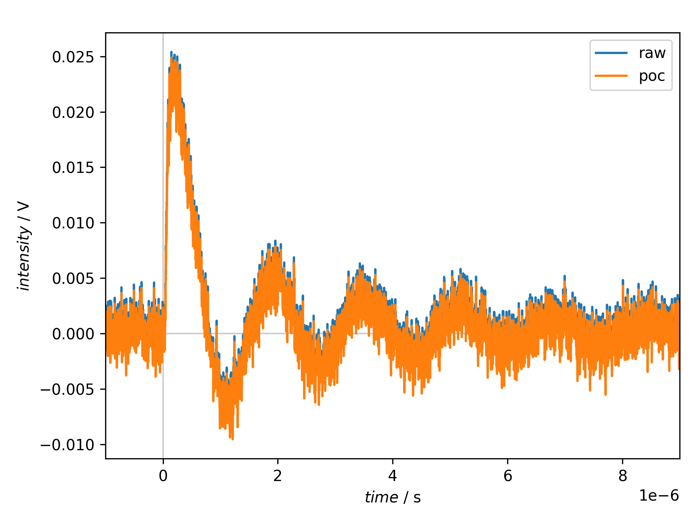

==============================
Pretrigger offset compensation
==============================

tr-EPR spectra are typically recorded as full time profiles for a series of magnetic field positions, and to obtain the full kinetics, it is crucial to record the time traces starting before the laser flash.

The part before the laser flash that triggers the actual measurement is usually termed "pretrigger offset". The first preprocessing step of raw data is hence to take this pretrigger offset and set its average to zero, *i.e.* average over this part of the time trace and subtract this average value from the entire time trace. This removes any DC offset of the recording.

A prerequisite of this preprocessing step is to have a time trace with a time axis starting at negative times, the trigger being defined by *t* = 0. If your recorded data start with *t* = 0 and a laser trigger at a later time *t* > 0, you need to :doc:`determine the pretrigger part of your time trace <pretrigger-determination>` first.

The actual processing step is a two-liner in a recipe:

.. literalinclude:: ../../examples/basic-processing-fr/basic-processing-fr.yaml
    :language: yaml
    :linenos:
    :lines: 37-38
    :lineno-start: 37

The other part of the recipe besides loading the data serves rather didactic purposes, such as plotting the raw and processed data and comparing extracted traces before and after processing.

Recipe
======

.. literalinclude:: ../../examples/basic-processing-fr/basic-processing-fr.yaml
    :language: yaml
    :linenos:
    :caption: Pretrigger offset compensation is always the first preprocessing step for tr-EPR data. The actual processing step is a two-liner, the rest of the recipe serves didactic purposes, mainly a graphical before--after cpmparison.

Result
======

The recipe actually creates three figures presented afterwards.

    The raw data as read, before pretrigger offset compensation. The actual signal is an oscillation (transient nutation), and the recorded data cover onyl the signal part.

    The data after pretrigger offset compensation. Due to the recording scheme used with internal background subtraction already within the transient recorder, the effect is only very small and barely visible here.

    Comparison of the identical time trace before (raw) and after (poc) pretrigger offset compensation. As mentioned above, due to the recording scheme used for these data, the effect is only very small.