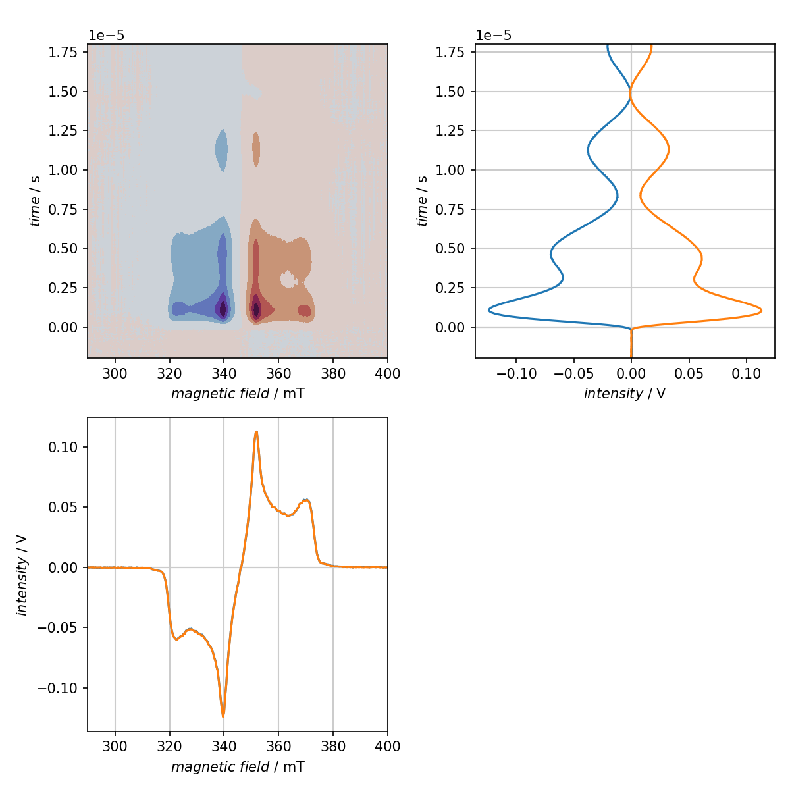

============================
Characteristics of a dataset
============================

Classes used:

* :class:`trepr.processing.PretriggerOffsetCompensation`
* :class:`trepr.processing.BackgroundCorrection`
* :class:`trepr.analysis.BasicCharacteristics`
* :class:`aspecd.processing.SliceExtraction`

Description
===========

As with all kinds of data, one of the first and most important steps is to get an overview of the resulting data and their characteristics. Furthermore, with a growing number of different measurements, keeping an overview is crucial. This is the realm of well-crafted, expressive graphical representations that are automatically generated, thus uniform and highly appropriate to compare different datasets and focus on their respective differences.

For tr-EPR data in particular, things get somewhat more complicated due to the two-dimensional nature of the data (magnetic field, time). One strategy to get a decent overview of the characteristics of a dataset would be:

* Graphical overview of the entire dataset (2D plot),

* Transients (slices along the time axis) at both, global maximum and global minimum, and

* Spectra (slices along the magnetic field axis) at both, global maximum and global minimum.

Of course, prior to plotting, the usual corrections (pretrigger offset compensation, background correction) need to be applied.

Recipe
======

.. literalinclude:: ../../examples/show-characteristics/show-characteristics.yaml
    :language: yaml
    :linenos:
    :caption: Complete recipe for creating a graphical representation consisting of three subpanels showing an overview of the entire dataset as 2D plot as well as transients and spectra at the global maximum and minimum, respectively. While automatically taking the global extrema might not always be the best idea, it is pretty useful for a first overview, at least as long as your data are not too noisy.

Result
======

    **Characteristics of a tr-EPR dataset at a glance.** The 2D plot in the top left panel provides an overview of the entire dataset, while the transients and spectra obtained for the global maximum and minimum, respectively, are presented parallel to the corresponding axes of the 2D plot. In this particular case, the spectra for maximum and minimum entirely overlap, meaning that maximum and minimum of the signal occur at the same time after the laser flash.