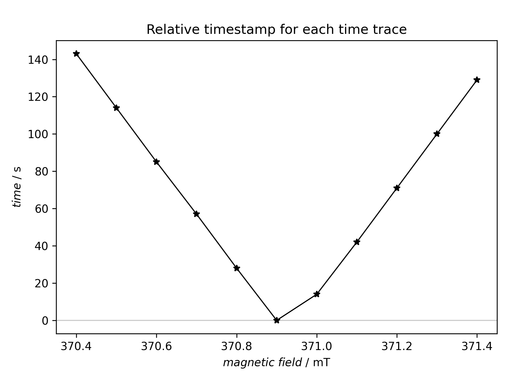
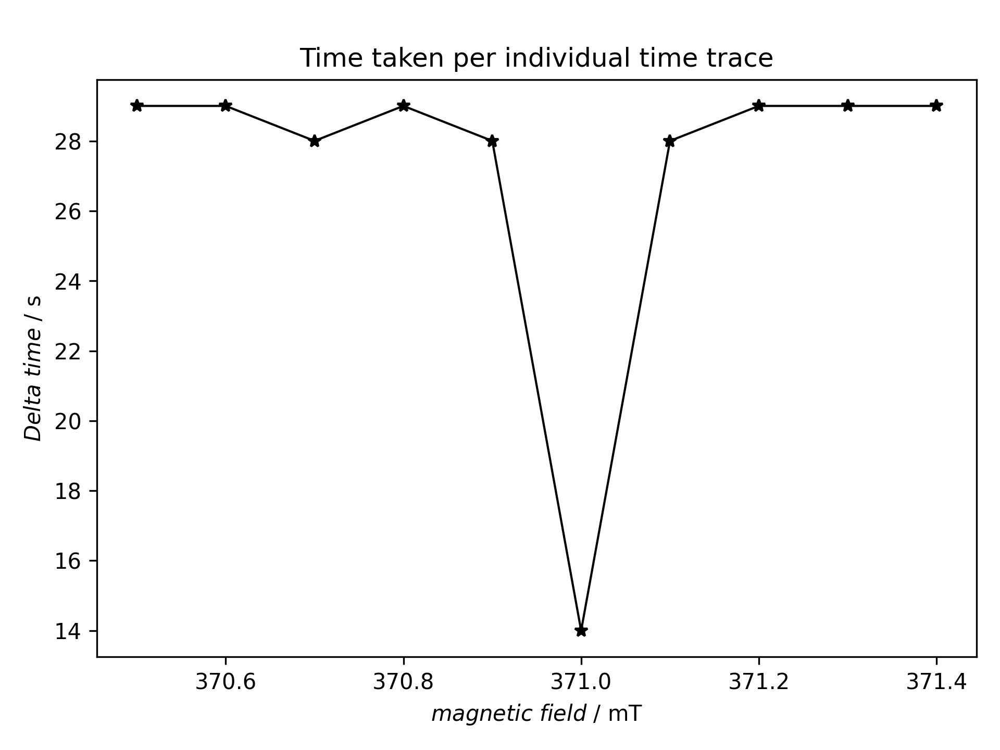

====================================
Time taken per individual time trace
====================================

Classes used:

* :class:`trepr.analysis.TimeStampAnalysis`

General description
===================

tr-EPR experiments usually take quite some time (hours rather than minutes) due to their 2D character. Generally, the time taken per time trace should be the same on average. Hence, it is a good way to check whether everything went well to simply plot the time taken per individual time trace as a function of the magnetic field positions. If there are some dramatic deviations, this is a good hint of some (intermediate) problems.

A necessary prerequisite to figure out how long recording of each individual time trace took is to record time stamps during the measurement, one per time trace. Using a commercial Bruker setup and software, this is usually not (easily) possible. However, if you use some lab-built software to control your tr-EPR setup, it is entirely up to this software.

The following example demonstrates what is possible when the relevant information is available for each individual time trace. Basically, the recipe creates two plots: the relative time (starting with the start of the measurement) each of the time traces has been recorded as function of the magnetic field, and the difference in time taken between two time traces as function of the magnetic field.

Recipe
======

.. literalinclude:: ../../examples/timestamp-analysis/timestamp-analysis.yaml
    :language: yaml
    :linenos:
    :caption: Analysing the time taken per individual time trace. If there is some strong deviation, this is a good first hint something went wrong with the measurement.

Result
======

The recipe actually creates two figures presented afterwards.

    The position in time (relative time stamp) for each individual time trace. The perhaps unexpected shape results from the fact that the data have not been recorded from low to high field (or *vice versa*), but inside out, starting at the centre position of the magnetic field axis.

    Relative time taken for each individual time trace. The perhaps unexpected shape results from the fact that the data have not been recorded from low to high field (or *vice versa*), but inside out, starting at the centre position of the magnetic field axis. This is why the difference between the first and second recorded time trace is half of the difference between all other time traces.

