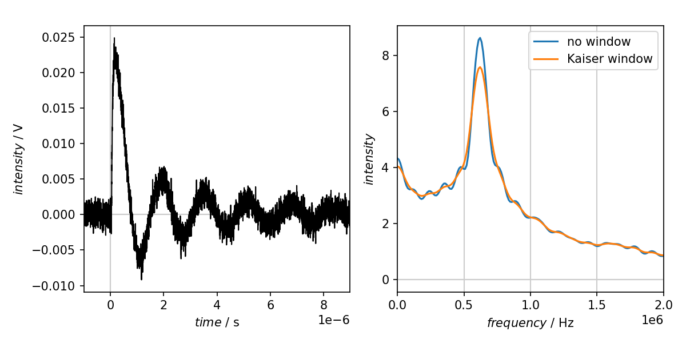
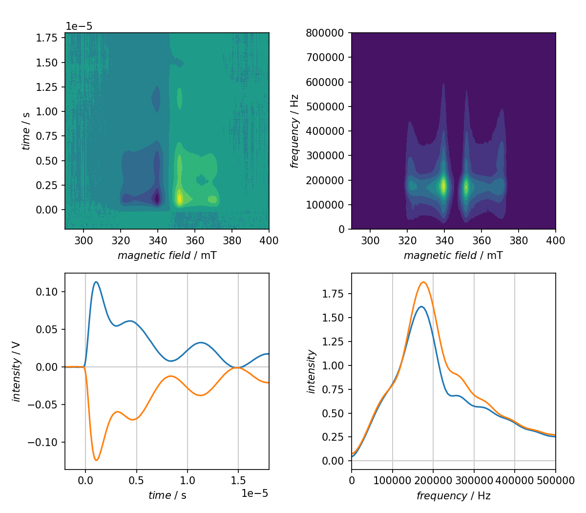

=======================
Transient nutation: FFT
=======================

Classes used:

* :class:`trepr.analysis.TransientNutationFFT`

General description
===================

Not all tr-EPR time traces show transient nutations, but if so, it may be of interest to extract the nutation frequency, as this allows to extract the local field strength of the microwave field at the sample location. The easiest way to extract the nutation frequency is by applying a 1D fast Fourier transform (FFT) along the time domain of the data.

The actual analysis step used, :class:`trepr.analysis.TransientNutationFFT`, works with both, 1D and 2D datasets. The difference of the two scenarios shown below is more in the need for pre- and post-processing of the data.

Transient nutation analysis in 1D
=================================

In case of signals showing strong oscillations with the signal passing the zero line multiple times, there is usually no need for any pre-processing of the data, such as subtracting an exponential decay. Experimentally, this situation is typically found in crystalline samples of dilute paramagnetic species, such as a single crystal consisting of pentacene in a *p*\ -terphenyl matrix.

Recipe
------

.. literalinclude:: ../../examples/transientnutation-fft/transientnutation-1d-fft.yaml
    :language: yaml
    :linenos:
    :caption: Transient nutation analysis by applying a 1D FFT along the time domain for a strongly oscillating signal. Additionally, the result of the direct FFT is compared to applying a window function.

Result
------

The resulting figure of the above recipe is shown below.

    Result of the transient nutation analysis applying a 1D FFT along the time domain. The situation of no window and applying a Kaiser window is compared. For this case, no window would be necessary to extract the nutation frequency.

Transient nutation analysis in 2D
=================================

As mentioned above, the :class:`trepr.analysis.TransientNutationFFT` analysis step does not care whether data are 1D or 2D, and can be applied to 2D data in the exact same way. The other difference here: The data used show still dominant transient nutations, but this time, the nutation is merely a modulation of the exponential decay. Hence, it is usually wise to subtract the exponential decay prior to applying the FFT.

Recipe
------

.. literalinclude:: ../../examples/transientnutation-fft/transientnutation-2d-fft.yaml
    :language: yaml
    :linenos:
    :caption: Transient nutation analysis of a full 2D tr-EPR dataset by applying a 1D FFT along the time domain for a weaker oscillating signal, where the oscillation is still prominent, but the time domain dominated by the exponential decay. Here, the transient nutation frequencies for the absorptive and emissive signal maxima are shown.

Result
------

The resulting figure of the above recipe is shown below.

    Result of the transient nutation analysis of a full 2D dataset by applying a 1D FFT along the time domain. The transient nutation frequencies for the absorptive and emissive signal maxima are shown.
